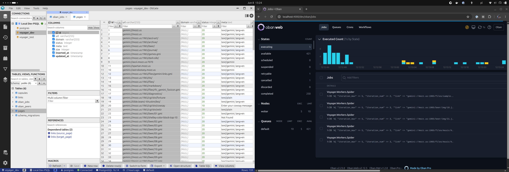

# Voyager

A crawler for the [Gemini Protocol](https://en.wikipedia.org/wiki/Gemini_(protocol)).

To start:

* Use a `docker compose up -d`
* Run `mix setup` to install and setup dependencies
* Start Phoenix endpoint inside IEx with `iex -S mix phx.server`
* Copy, paste, and run: `Voyager.enqueue()`
* Now visit [`localhost:4000`](http://localhost:4000/dev/oban/jobs)
* Connect via DB client to observe pages crawled.

No throttling currently so please don't do this too often to avoid hitting hosts too hard.
